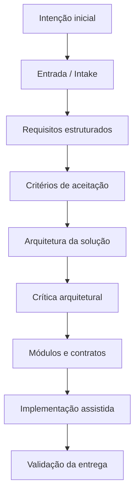

# DEVA — Acelerador Médico

> Sistema de inteligência decisória para mentoria, acompanhamento de evolução e aumento de LTV em programas de aceleração médica.

## Visão geral

O **DEVA — Acelerador Médico** é uma solução aplicada ao contexto de mentoria e aceleração de profissionais da área médica. O projeto organiza dados de evolução dos alunos/clientes em uma camada de decisão para mentores, combinando indicadores operacionais, radar de evolução, matriz de decisão e centro de comando.

A proposta não é apenas exibir métricas bonitas. O objetivo é ajudar o mentor a responder rapidamente:

- quem está evoluindo bem;
- quem precisa de reengajamento;
- quem demanda ajuste na entrega do produto/mentoria;
- quem está pronto para renovação, recorrência ou upsell;
- onde cada aluno deve concentrar o próximo esforço.

Em bom português de operação: menos achismo, mais ação.

## Case

- **Cliente:** Acelerador Médico
- **Projeto:** DEVA
- **Repositório:** `INNOVAI-LTDA/swaif_LTV-mentor`
- **Tipo de solução:** Sistema de apoio à decisão para mentoria, retenção e LTV
- **Foco de negócio:** transformar dados de acompanhamento em clareza operacional para mentor e aluno

## Problema que a solução resolve

Programas de mentoria costumam acumular dados dispersos sobre desempenho, engajamento e evolução dos participantes. Sem uma camada de decisão, esses dados viram apenas histórico: existem, mas não orientam a próxima ação.

O DEVA resolve esse problema ao estruturar a leitura da evolução em três níveis:

1. **Métricas:** indicadores atômicos de desempenho.
2. **Pilares:** agrupamentos semânticos de métricas.
3. **Visões de decisão:** telas que transformam pontuações em ação.

## Conceito funcional

A solução trabalha com dois públicos principais:

### Mentor

O mentor tem acesso à visão estratégica e operacional:

- Matriz de Decisão;
- Radar de Evolução por aluno;
- Centro de Comando;
- drill-down por pilar e métrica;
- priorização de alunos por criticidade, prontidão de renovação ou necessidade de intervenção.

### Aluno

O aluno acessa uma visão mais construtiva e orientada à evolução:

- seu próprio Radar de Evolução;
- detalhes dos seus pilares;
- métricas associadas;
- próximos focos recomendados.

A linguagem para o aluno deve evitar tom punitivo. A tela não é um boletim vermelho gigante; é um mapa de progresso.

## Visões principais

### 1. Matriz de Decisão

A Matriz de Decisão é a visão mentor-only para classificar o aluno conforme dois eixos principais:

- **Valor entregue / produto percebido**
- **Engajamento / aderência do aluno**

A combinação desses eixos permite classificar o aluno em quadrantes de ação, como:

- oportunidade de renovação;
- necessidade de reengajamento;
- ajuste na entrega do produto;
- intervenção crítica.

### 2. Radar de Evolução

O Radar de Evolução apresenta os pilares do aluno em formato visual, permitindo identificar rapidamente forças, fragilidades e prioridades.

Pilares inicialmente previstos:

- Aquisição;
- Vendas;
- Mindset;
- Gestão;
- Repertório / Portfólio.

Cada pilar é composto por métricas normalizadas em percentual, permitindo comparação entre indicadores originalmente heterogêneos.

### 3. Centro de Comando

O Centro de Comando é a camada de gestão de portfólio do mentor. Ele deve responder perguntas como:

- quais alunos estão melhor posicionados;
- quais estão mais críticos;
- quem precisa de ação imediata;
- quem está próximo de uma renovação;
- quais padrões aparecem por produto, turma, mentor ou coorte.

## Feature discutida: View do Aluno

Durante o refinamento da solução, foi discutida uma feature específica para criação/ajuste da visão do aluno.

Escopo funcional considerado:

- o aluno reutiliza o mecanismo atual de autenticação;
- a senha inicial da feature é fixa para homologação;
- o aluno pode editar somente valores de métricas;
- os tipos de valor das métricas já existem na base de dados;
- a atualização de métrica deve persistir no backend após confirmação do usuário;
- os valores de baseline permanecem e passam a conviver com os valores reais atualizados.

Essa feature reforça a direção do produto: o DEVA não é apenas dashboard para mentor, mas também uma interface de clareza e evolução para o participante.

## Modelo de decisão

A lógica recomendada calcula scores normalizados de 0 a 100:

```text
metric_percentage ∈ [0, 100]
```

Cada pilar é calculado como média das métricas associadas:

```text
pillar_score = average(metric_percentages_in_pillar)
```

A matriz utiliza eixos derivados dos pilares:

```text
product_score = average(acquisition, sales, management, repertoire)
engagement_score = mindset
```

O limiar inicial recomendado é 70/70:

- Produto >= 70: entrega forte de valor;
- Produto < 70: entrega fraca ou em atenção;
- Engajamento >= 70: bom engajamento;
- Engajamento < 70: baixa aderência.

## Processo de construção SDLC / V-Bounce

A solução foi elaborada usando um processo progressivo inspirado em SDLC AI-native e V-Bounce, com agentes especializados por etapa.

Fluxo utilizado:



Cada fase produz artefatos formais e passa por gates de descida. A intenção é evitar o clássico salto ornamental: sair de uma ideia meio nebulosa direto para código e depois culpar o framework.

## Artefatos típicos do processo

- `Intake.md`
- `Especificacao_Requisitos.md`
- `Criterios_Aceitacao.md`
- `Arquitetura_Solucao.md`
- `Riscos_Arquiteturais.md`
- `Modulos_Contratos.md`
- `Relatorio_Validacao_Entrega.md`

## Arquitetura operacional do repositório

O repositório também incorpora um modelo operacional com BMAD/Codex para execução supervisionada por artefatos.

Princípios relevantes:

- artefatos como fonte de verdade da execução;
- estado local para controle de fase;
- comandos com contratos estruturados;
- execução local assistida por Codex;
- validação de resposta e geração de logs;
- aprovação humana entre fases.

Isso combina bem com a proposta do DEVA: a solução nasce orientada por requisitos, contratos, validação e rastreabilidade — não por improviso heroico de sexta-feira à noite.

## Valor de negócio

O DEVA ajuda o Acelerador Médico a:

- priorizar alunos que exigem ação imediata;
- aumentar clareza sobre evolução individual;
- melhorar timing de intervenção;
- apoiar retenção e renovação;
- identificar oportunidades de upsell;
- reduzir subjetividade nas decisões de mentoria;
- aumentar LTV por meio de acompanhamento mais inteligente.

## Próximos passos recomendados

- consolidar contratos de API para Radar, Matriz e Centro de Comando;
- separar claramente permissões de mentor e aluno;
- implementar persistência dos valores reais informados pelo aluno;
- manter baseline histórico para comparação;
- criar testes de aceitação para fluxos críticos;
- validar UX da View Aluno com linguagem construtiva e não punitiva.

## Status

Projeto em evolução, com base conceitual definida, protótipo visual explorado e processo SDLC/V-Bounce aplicado para guiar implementação progressiva.
