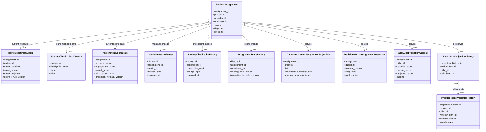
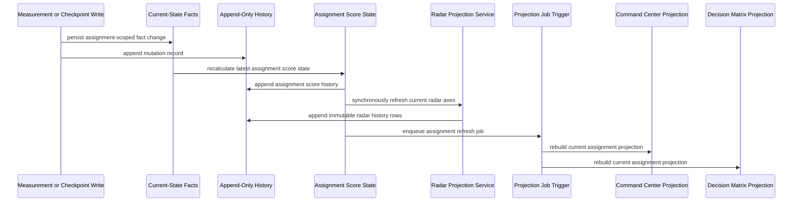
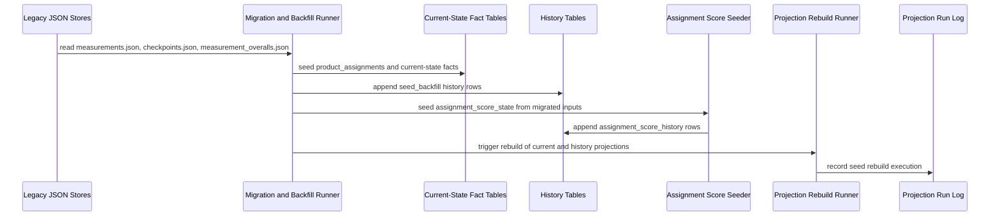
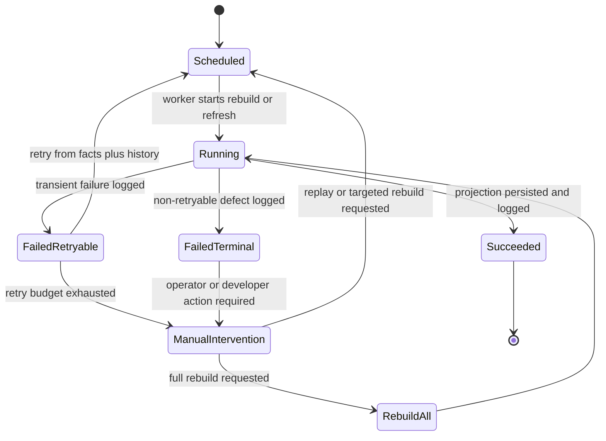
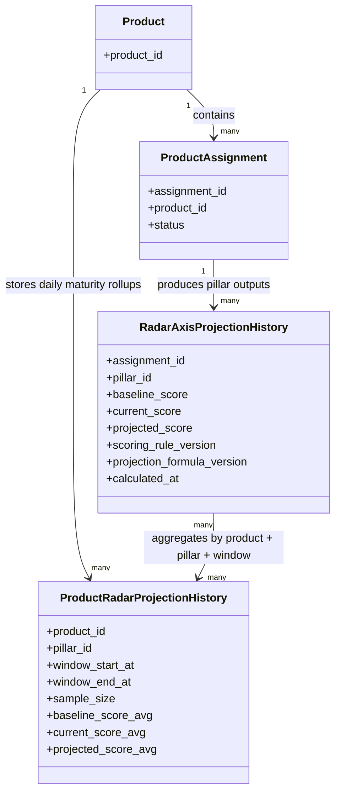

# Architecture Baseline - Command Center, Evolution Radar, and Decision Matrix

## 1. Purpose

This document resolves the open decisions left in Section 8 of the PRD and turns them into a minimum architecture baseline that implementation can follow without reopening already decided product requirements.

This baseline is intentionally narrow:

- preserve the frozen v1 API contracts
- preserve the current backend layering of routes -> services -> repositories
- define authoritative facts, history, and projections separately
- decide freshness, rebuild, and version-traceability rules now

This is not full implementation planning and not final DDL. It is the architecture baseline that future implementation stories must honor.

## 2. Binding Constraints

The following requirements are treated as already decided and therefore constrain every choice below:

- history capture starts on day one
- Radar history is first-class
- Radar student-to-mentor visibility target is 1 second tolerance
- dedicated projection tables are required now
- `decision_matrix_status` is helper state, not authoritative workflow state
- historical analytical outputs remain immutable after scoring-rule changes
- every persisted derived output must be traceable to the rule version used
- Command Center anomalies matter, but durable anomaly records are not required in the first architecture slice

The architecture must also remain compatible with:

- stable v1 API boundaries and DTOs
- current service ownership in `backend/app/services`
- repository ownership in `backend/app/storage`
- the internal canonical domain direction in `docs/architecture/canonical-data-architecture.md`

## 3. Decision Summary

| Open decision | Baseline decision |
| --- | --- |
| Physical schema | Use a three-layer model: authoritative current-state facts, append-only history, and rebuildable projections. |
| History model | Use hybrid current-state plus append-only history from day one; snapshots are derived artifacts, not the primary source of truth. |
| Projection refresh | Radar refresh is synchronous per affected assignment. Command Center and Decision Matrix refresh asynchronously through assignment-scoped projection jobs. |
| Latency targets | Radar `<= 1s` target per affected assignment; Command Center `<= 15s`; Decision Matrix `<= 60s`. |
| Retention/rebuild/backfill | History is retained for the assignment lifetime with no TTL in v1; projections are disposable and fully rebuildable from facts plus history. |
| Product-maturity aggregation | Product-level Radar is computed as time-windowed, equal-weight aggregation of assignment pillar outputs by product and pillar. |
| Anomaly lifecycle | Current phase stores anomaly hints only inside Command Center projections. If promoted later, anomalies become a separate durable signal table with explicit state transitions. |

## 4. Baseline Architecture

### 4.1 Layer Model

The architecture is divided into three storage layers.

#### A. Authoritative current-state facts

This layer stores the latest business truth required for operational serving and recomputation.

Baseline entities:

- `product_assignments`
  - canonical continuation of current enrollment state
  - one row per active or historical assignment
- `metric_measures_current`
  - latest current-state value per assignment x metric
- `journey_checkpoints_current`
  - latest current-state checkpoint row per assignment x checkpoint week
- `assignment_score_state`
  - latest derived score state per assignment
  - stores current progress, engagement, overall, and per-pillar score summaries required repeatedly by multiple views

#### B. Append-only history

This layer stores immutable evidence and version lineage.

Baseline entities:

- `metric_measure_history`
  - append-only record for every measurement insert or update
- `journey_checkpoint_history`
  - append-only record for every checkpoint insert or update
- `assignment_score_history`
  - append-only record for each recalculated assignment score state
- `projection_run_log`
  - append-only record for each projection refresh attempt, success, or rebuild run

#### C. Read-optimized projections

This layer stores disposable query shapes that serve the three analytical surfaces efficiently.

Baseline entities:

- `command_center_assignment_projection`
  - one current row per assignment
- `decision_matrix_assignment_projection`
  - one current row per assignment
- `radar_axis_projection_current`
  - one current row per assignment x pillar
- `radar_axis_projection_history`
  - immutable row per assignment x pillar x calculation timestamp
- `product_radar_projection_history`
  - immutable aggregate row per product x pillar x aggregation window

The projection layer is not authoritative business truth. If incorrect, it is rebuilt. It must never become the only location of critical historical evidence.

### 4.2 Ownership and Repository Boundary

Routes remain thin. Services continue to own business rules. Repositories continue to own persistence details.

The baseline introduces new repository families, but not a new bypass path:

- fact repositories for current-state tables
- history repositories for append-only evidence
- projection repositories for read models and rebuild operations

Frontend contracts do not change. Existing backend endpoints continue to return the frozen v1 shapes, with projection-backed services behind them.

### 4.3 UML - Storage Model Overview

The diagram below shows the baseline separation between authoritative current-state facts, append-only history, and read-optimized projections.

## 5. Physical Schema Baseline

### 5.1 Current-State Fact Tables

#### `product_assignments`

Purpose:

- authoritative lifecycle row for mentor x student x product assignment

Required fields:

- `assignment_id`
- `product_id`
- `provider_id`
- `end_user_id`
- `status`
- `start_at`
- `end_at`
- `days_left`
- `ltv_cents`
- `created_at`
- `updated_at`

Notes:

- this is the canonical target under the existing enrollment concept
- `decision_matrix_status` may remain as a compatibility/helper field, but not as authoritative matrix state

#### `metric_measures_current`

Purpose:

- latest measurement state per assignment x metric

Required fields:

- `measure_id`
- `assignment_id`
- `metric_id`
- `value_baseline`
- `value_current`
- `value_projected`
- `improving_trend`
- `source_recorded_at`
- `last_calculated_at`
- `metric_definition_version`
- `scoring_rule_version`
- `updated_at`

Key rule:

- unique key on `assignment_id + metric_id`

#### `journey_checkpoints_current`

Purpose:

- latest checkpoint state per assignment x week

Required fields:

- `checkpoint_id`
- `assignment_id`
- `checkpoint_week`
- `status`
- `label`
- `source_recorded_at`
- `updated_at`

Key rule:

- unique key on `assignment_id + checkpoint_week`

#### `assignment_score_state`

Purpose:

- latest multi-view score state used by Radar, Command Center, and Decision Matrix

Required fields:

- `assignment_id`
- `progress_score`
- `engagement_score`
- `overall_score`
- `pillar_scores_json`
- `scoring_rule_version`
- `projection_formula_version`
- `calculated_at`
- `source_effective_at`

Key rule:

- one current row per `assignment_id`

### 5.2 History Tables

#### `metric_measure_history`

Append-only row per measurement mutation.

Required fields:

- `history_id`
- `measure_id`
- `assignment_id`
- `metric_id`
- `change_type`
  - `seed_backfill | create | update | recompute`
- `value_baseline`
- `value_current`
- `value_projected`
- `improving_trend`
- `source_recorded_at`
- `captured_at`
- `metric_definition_version`
- `scoring_rule_version`
- `source_hash`

#### `journey_checkpoint_history`

Append-only row per checkpoint mutation.

Required fields:

- `history_id`
- `checkpoint_id`
- `assignment_id`
- `checkpoint_week`
- `change_type`
- `status`
- `label`
- `source_recorded_at`
- `captured_at`
- `source_hash`

#### `assignment_score_history`

Append-only score lineage used to explain historical outputs.

Required fields:

- `history_id`
- `assignment_id`
- `progress_score`
- `engagement_score`
- `overall_score`
- `pillar_scores_json`
- `scoring_rule_version`
- `projection_formula_version`
- `calculated_at`
- `source_effective_at`

#### `projection_run_log`

Purpose:

- append-only execution evidence for refresh, retry, rebuild, and seed-backfill runs

Required fields:

- `run_id`
- `projection_target`
  - `radar_assignment_current | radar_assignment_history | command_center_assignment | decision_matrix_assignment | product_radar_history | multi_target`
- `scope_type`
  - `assignment | mentor_portfolio | product | full_rebuild | seed_backfill`
- `scope_id`
- `trigger_type`
  - `write_refresh | async_refresh | targeted_retry | targeted_rebuild | full_rebuild | seed_backfill`
- `started_at`
- `finished_at`
- `state`
  - `scheduled | running | succeeded | failed_retryable | failed_terminal | superseded`
- `attempt_number`
- `run_generation`
- `replaces_generation`
- `retry_of_run_id`
- `scoring_rule_version`
- `projection_formula_version`
- `source_effective_at`
- `failure_class`
  - `none | validation | dependency | timeout | data_gap | code_defect | operator_cancelled`
- `failure_code`
- `failure_message`

Key rules:

- one durable row is created before projection execution starts and updated only to close the same run lifecycle
- successful rebuilds and replacement generations are tracked by `run_generation` and `replaces_generation`
- failures are classified without deleting the originating run record

### 5.3 Projection Tables

#### `command_center_assignment_projection`

Purpose:

- current operational row for mentor-facing list/detail serving

Required fields:

- `assignment_id`
- `provider_id`
- `end_user_id`
- `product_id`
- `urgency`
- `risk`
- `days_left`
- `day`
- `total_days`
- `progress_score`
- `engagement_score`
- `hormozi_score`
- `ltv_cents`
- `checkpoint_summary_json`
- `anomaly_summary_json`
- `projection_formula_version`
- `scoring_rule_version`
- `calculated_at`
- `source_effective_at`

#### `decision_matrix_assignment_projection`

Purpose:

- current matrix row for portfolio serving

Required fields:

- `assignment_id`
- `provider_id`
- `end_user_id`
- `product_id`
- `progress_score`
- `engagement_score`
- `quadrant`
- `renewal_reason`
- `suggestion`
- `days_left`
- `urgency`
- `ltv_cents`
- `markers_json`
- `projection_formula_version`
- `scoring_rule_version`
- `calculated_at`
- `source_effective_at`

#### `radar_axis_projection_current`

Purpose:

- current pillar-by-pillar Radar output per assignment

Required fields:

- `assignment_id`
- `provider_id`
- `end_user_id`
- `product_id`
- `pillar_id`
- `axis_key`
- `axis_label`
- `axis_sub`
- `baseline_score`
- `current_score`
- `projected_score`
- `insight`
- `scoring_rule_version`
- `projection_formula_version`
- `calculated_at`
- `source_effective_at`

Key rule:

- unique key on `assignment_id + pillar_id`

#### `radar_axis_projection_history`

Purpose:

- immutable history of assignment Radar outputs

Required fields:

- `projection_history_id`
- `projection_run_id`
- `assignment_id`
- `pillar_id`
- `axis_key`
- `baseline_score`
- `current_score`
- `projected_score`
- `insight`
- `rebuild_generation`
- `scoring_rule_version`
- `projection_formula_version`
- `calculated_at`
- `source_effective_at`

Key rule:

- never update existing rows

#### `product_radar_projection_history`

Purpose:

- immutable product-level maturity trend over time

Required fields:

- `projection_history_id`
- `projection_run_id`
- `product_id`
- `pillar_id`
- `window_start_at`
- `window_end_at`
- `sample_size`
- `baseline_score_avg`
- `current_score_avg`
- `projected_score_avg`
- `rebuild_generation`
- `scoring_rule_version`
- `projection_formula_version`
- `calculated_at`
- `source_effective_at`

### 5.4 UML - Physical Schema Relationship View

The diagram below gives a compact ER-style view of the fact, history, and projection tables defined in this section.

```mermaid
erDiagram
  PRODUCT_ASSIGNMENTS ||--o{ METRIC_MEASURES_CURRENT : owns
  PRODUCT_ASSIGNMENTS ||--o{ JOURNEY_CHECKPOINTS_CURRENT : owns
  PRODUCT_ASSIGNMENTS ||--|| ASSIGNMENT_SCORE_STATE : derives

  PRODUCT_ASSIGNMENTS ||--o{ METRIC_MEASURE_HISTORY : records
  PRODUCT_ASSIGNMENTS ||--o{ JOURNEY_CHECKPOINT_HISTORY : records
  PRODUCT_ASSIGNMENTS ||--o{ ASSIGNMENT_SCORE_HISTORY : records

  PRODUCT_ASSIGNMENTS ||--|| COMMAND_CENTER_ASSIGNMENT_PROJECTION : serves
  PRODUCT_ASSIGNMENTS ||--|| DECISION_MATRIX_ASSIGNMENT_PROJECTION : serves
  PRODUCT_ASSIGNMENTS ||--o{ RADAR_AXIS_PROJECTION_CURRENT : serves
  PRODUCT_ASSIGNMENTS ||--o{ RADAR_AXIS_PROJECTION_HISTORY : preserves

  RADAR_AXIS_PROJECTION_HISTORY o{--|| PRODUCT_RADAR_PROJECTION_HISTORY : rolls_up_into

  PRODUCT_ASSIGNMENTS {
    string assignment_id PK
    string product_id
    string provider_id
    string end_user_id
    string status
    int days_left
    int ltv_cents
  }

  METRIC_MEASURES_CURRENT {
    string assignment_id FK
    string metric_id
    float value_baseline
    float value_current
    float value_projected
    string scoring_rule_version
  }

  JOURNEY_CHECKPOINTS_CURRENT {
    string assignment_id FK
    int checkpoint_week
    string status
    string label
  }

  ASSIGNMENT_SCORE_STATE {
    string assignment_id PK
    float progress_score
    float engagement_score
    float overall_score
    string projection_formula_version
  }

  METRIC_MEASURE_HISTORY {
    string history_id PK
    string assignment_id FK
    string metric_id
    string change_type
    datetime captured_at
  }

  JOURNEY_CHECKPOINT_HISTORY {
    string history_id PK
    string assignment_id FK
    int checkpoint_week
    string change_type
    datetime captured_at
  }

  ASSIGNMENT_SCORE_HISTORY {
    string history_id PK
    string assignment_id FK
    string scoring_rule_version
    string projection_formula_version
    datetime calculated_at
  }

  COMMAND_CENTER_ASSIGNMENT_PROJECTION {
    string assignment_id PK
    string urgency
    string risk
    datetime calculated_at
  }

  DECISION_MATRIX_ASSIGNMENT_PROJECTION {
    string assignment_id PK
    string quadrant
    string urgency
    datetime calculated_at
  }

  RADAR_AXIS_PROJECTION_CURRENT {
    string assignment_id FK
    string pillar_id
    float baseline_score
    float current_score
    float projected_score
  }

  RADAR_AXIS_PROJECTION_HISTORY {
    string projection_history_id PK
    string assignment_id FK
    string pillar_id
    datetime calculated_at
  }

  PRODUCT_RADAR_PROJECTION_HISTORY {
    string projection_history_id PK
    string product_id
    string pillar_id
    datetime window_start_at
    datetime window_end_at
    int sample_size
  }
```

## 6. History Model Decision

### 6.1 Chosen Model

The baseline adopts a hybrid history model:

- current-state tables serve the latest authoritative value
- append-only history preserves every meaningful measurement, checkpoint, and score change
- snapshots exist only as derived outputs when needed for reporting or rebuild acceleration

### 6.2 Why This Model

This is the narrowest model that satisfies all decided requirements:

- full event sourcing is not required to preserve day-one history
- current-state serving remains operationally simple
- historical outputs can remain immutable because the calculation lineage is persisted
- rebuildable projections stay possible without making projection tables authoritative

### 6.3 Snapshot Policy

Snapshots are allowed for reporting and backfill safety, but they are not the primary source of truth.

Allowed snapshot uses:

- migration seed snapshots
- operator-triggered backup before a major scoring-rule rollout
- periodic product-level reporting extracts

Not allowed:

- using snapshots as the only history mechanism
- rewriting past Radar history rows in place after a scoring-rule change

## 7. Projection Refresh Model

### 7.1 Write Flow

For any measurement or checkpoint write affecting one assignment:

1. persist current-state fact change
2. append matching history row
3. recalculate `assignment_score_state`
4. append `assignment_score_history`
5. synchronously refresh `radar_axis_projection_current`
6. append immutable `radar_axis_projection_history` rows for the affected pillars
7. enqueue assignment-scoped refresh for Command Center and Decision Matrix projections

This keeps the single-assignment Radar path inside the 1-second target while avoiding unnecessary synchronous fan-out for broader portfolio views.

### 7.2 Refresh Modes by Surface

#### Evolution Radar

- refresh mode: synchronous, assignment-scoped
- trigger: any write affecting assignment measurements, checkpoints, or scoring configuration used by that assignment
- reason: the PRD requires mentor-visible propagation within 1 second for the same enrollment context

#### Command Center

- refresh mode: asynchronous, assignment-scoped post-write projection
- trigger: any assignment write affecting urgency, days left, checkpoints, engagement, progress, or anomaly rules
- reason: operational surface needs near-real-time freshness, but not the same synchronous strictness as Radar

#### Decision Matrix

- refresh mode: asynchronous, assignment-scoped post-write projection
- trigger: any assignment write affecting progress, engagement, urgency, LTV, classification, or renewal reasoning inputs
- reason: portfolio view tolerates slightly more lag and benefits from decoupled recompute

### 7.3 Projection Execution Pattern

The baseline does not require a queue technology decision yet. It does require an execution contract:

- projection refreshes are idempotent
- refreshes can run per assignment or by rebuild batch
- each execution writes `projection_run_log`
- failed projection refreshes do not roll back persisted facts
- failed refreshes must be retryable from source facts plus history

The concrete execution-log schema and replacement-generation rules are fixed in Appendix A and are binding for implementation.

### 7.4 UML - Assignment Update and Projection Refresh

The diagram below makes the refresh contract explicit for a single assignment write.

## 8. Latency Budgets

The baseline sets explicit targets for implementation and testing.

| Surface | Target |
| --- | --- |
| Assignment Radar | `<= 1 second` from committed write to mentor-visible assignment payload |
| Command Center | `<= 15 seconds` from committed write to refreshed assignment row |
| Decision Matrix | `<= 60 seconds` from committed write to refreshed assignment row |

Interpretation:

- these are architecture targets, not API timeout targets
- they apply to the affected assignment after a successful write
- rebuild jobs may exceed these budgets; only normal operational refresh is bound by them

## 9. Retention, Rebuild, and Backfill Policy

### 9.1 Retention

- `metric_measure_history`, `journey_checkpoint_history`, and `assignment_score_history` are retained for the lifetime of the assignment with no v1 TTL
- `radar_axis_projection_history` and `product_radar_projection_history` are also retained with no v1 TTL
- current-state fact tables and current projections hold only the latest state

### 9.2 Rebuild Rules

Projections are always rebuildable.

Allowed rebuild scopes:

- one assignment
- one mentor portfolio
- one product
- full projection rebuild

Rebuild source order:

1. current-state facts for latest serving state
2. append-only history for immutable lineage and time-sliced rebuilds
3. rule catalog versions from metric and pillar definitions

Named rebuild policy:

- use an append-only replacement-generation policy for immutable projection history
- `metric_measure_history`, `journey_checkpoint_history`, and `assignment_score_history` are never regenerated in place; corrections arrive only as new fact/history mutations
- `command_center_assignment_projection`, `decision_matrix_assignment_projection`, and `radar_axis_projection_current` may be replaced in place because they are disposable current-serving rows
- `radar_axis_projection_history` and `product_radar_projection_history` may only be corrected by appending a higher `rebuild_generation` linked to a successful `projection_run_log.run_id`
- the default read path for immutable projection history selects the highest successful generation for the same logical key; older generations remain queryable for audit and operator diagnosis
- a failed rebuild never becomes the active generation; only a run closed as `succeeded` can supersede an earlier generation

### 9.3 Backfill Policy

Initial migration from JSON-backed stores must backfill both current-state facts and history.

Required behavior:

- existing `enrollments.json` rows seed `product_assignments`
- existing `measurements.json` rows become `metric_measures_current`
- existing `checkpoints.json` rows become `journey_checkpoints_current`
- existing `measurement_overalls.json` rows seed `assignment_score_state`
- each seeded row also writes matching history rows with `change_type = seed_backfill`
- the seed run writes `projection_run_log` so later operators can identify which rows originated from migration

Appendix C defines the authoritative seed and reconstruction rules for `product_assignments`, compatibility child identifiers, and display-field assembly.

### 9.4 UML - Migration and Backfill Sequence

The diagram below makes the initial migration and day-one history seeding path explicit.

### 9.5 UML - Projection Rebuild and Failure Handling

The diagram below captures the expected operational state transitions for projection jobs without locking the design to a specific queue product.

## 10. Product-Level Radar Aggregation Rule

### 10.1 Aggregation Unit

Product maturity is defined as aggregated assignment pillar outputs, not raw metric values directly.

The aggregation unit is:

- one active assignment
- one pillar
- one aggregation window

### 10.2 Baseline Formula

For each `product_id + pillar_id + window`:

- `baseline_score_avg = arithmetic mean of assignment baseline_score`
- `current_score_avg = arithmetic mean of assignment current_score`
- `projected_score_avg = arithmetic mean of assignment projected_score`

All active assignments in the window are weighted equally.

### 10.3 Inclusion Rules

Include only assignments that are:

- active during the aggregation window
- backed by a valid pillar projection for the same rule version set
- not missing the required pillar output

Exclude:

- inactive assignments outside the window
- incomplete assignments without a valid pillar projection row
- rows computed under incompatible formula versions inside the same aggregate batch

### 10.4 Windowing Rule

The default product-level Radar window is daily.

Rationale:

- it is granular enough to support trend analysis
- it avoids excessive write volume from per-write product snapshots
- it is consistent with the requirement for historical product maturity without forcing immediate global recompute on every student write

Assignment Radar remains per-write. Product Radar history is rolled up daily from assignment-level projection history.

### 10.5 UML - Product Radar Rollup

The diagram below shows how product maturity is derived from assignment-level pillar outputs instead of raw metric rows.

## 11. Versioning and Immutability Rule

Every persisted derived output must store enough lineage to explain why it exists.

Mandatory version fields on all derived-state and projection rows:

- `scoring_rule_version`
- `projection_formula_version`
- `calculated_at`
- `source_effective_at`

Additional rule:

- a scoring-rule change creates new derived rows going forward
- it does not rewrite prior `assignment_score_history`, `radar_axis_projection_history`, or `product_radar_projection_history`
- current-state tables may move to the newest version; history tables must not
- replacement generations created under Appendix A keep prior immutable rows queryable and do not relax the append-only rule

## 12. Anomaly Storage and Lifecycle

### 12.1 Current Baseline

Anomalies are not authoritative business records in this phase.

Therefore:

- anomaly hints live inside `command_center_assignment_projection`
- anomaly timeline payloads are derived from the current projection plus checkpoint and measurement context
- no separate anomaly truth table is required to unblock this architecture

### 12.2 Future Promotion Path

If anomalies later become operational records, the architecture baseline reserves a dedicated table:

- `command_center_anomaly_signal`

Required lifecycle states for that future table:

- `open`
- `acknowledged`
- `resolved`
- `expired`

Required future fields:

- `signal_id`
- `assignment_id`
- `marker`
- `value`
- `reference_value`
- `cause`
- `recommended_action`
- `status`
- `detected_at`
- `resolved_at`
- `rule_version`

This promotion path is reserved but not required for the first implementation slice.

## 13. Compatibility With Current Repo

This baseline is compatible with the current repo because it preserves the nearest existing abstractions:

- route handlers stay thin under `backend/app/api/routes`
- business logic remains in services
- repositories own the move from JSON-backed files to the new physical store
- the current `IndicatorCargaService` read assembly becomes the transitional seam where projection-backed reads can replace live JSON aggregation incrementally

No frontend contract changes are required. Adapters and UI continue to consume the frozen v1 shapes.

## 14. Implementation Baseline for Next Step

Any implementation plan derived from this document must satisfy all of the following:

1. Introduce fact, history, and projection persistence separately.
2. Seed history from day one, including migration backfill.
3. Keep Radar refresh synchronous per assignment and validate the `<= 1 second` target.
4. Keep Command Center and Decision Matrix projection refresh decoupled and retryable.
5. Persist rule-version lineage on every derived output.
6. Preserve the current v1 endpoint contracts and error envelope.
7. Treat anomaly durability as deferred unless a later story explicitly promotes it.

## 15. Final Baseline

The architecture baseline for Command Center, Evolution Radar, and Decision Matrix is:

- canonical assignment, measurement, checkpoint, and score facts as the write-authoritative model
- append-only history for measurements, checkpoints, and scores from day one
- synchronous assignment-scoped Radar projection refresh
- asynchronous assignment-scoped Command Center and Decision Matrix refresh
- immutable Radar and product-maturity history projections with explicit version lineage
- projection tables treated as disposable serving artifacts, never as business truth

This resolves the PRD open decisions without changing the frozen API contracts or bypassing the current service and repository boundaries.

## Appendix A. Projection Run Logging and Rebuild-Generation Policy

This appendix is normative for all refresh, retry, rebuild, and migration-seed executions.

### A.1 `projection_run_log` usage contract

- create the `projection_run_log` row before any projection write begins
- close the same row with `finished_at` and terminal `state` when the execution ends
- use `projection_target = multi_target` when one orchestration run refreshes more than one projection family
- use `scope_type` and `scope_id` to keep assignment-scoped refreshes, mentor portfolio rebuilds, product rollups, and seed backfills distinguishable without relying on free-text log parsing
- increment `attempt_number` when replaying the same failed run scope
- set `retry_of_run_id` when a retry directly follows a prior failed run

### A.2 Replacement-generation policy

The approved policy name is `append_only_replacement_generation`.

Rules:

- current-serving projections may be replaced in place because they are disposable serving artifacts
- immutable projection history is never updated or deleted in place
- when a historical rebuild corrects already-served Radar or product-history output, it appends a new `rebuild_generation` instead of mutating the prior row
- the successful rebuild records `run_generation = previous_generation + 1` and `replaces_generation = previous_generation` in `projection_run_log`
- every newly appended immutable history row from that rebuild carries the same `projection_run_id` and the new `rebuild_generation`
- read paths that serve v1 historical outputs select the highest successful generation per logical key, while audit paths may inspect earlier generations explicitly
- if a rebuild fails, no new generation becomes active and the previous successful generation remains the serving baseline

### A.3 Failure classification contract

- `validation`: source facts or required rule metadata are incomplete or invalid
- `dependency`: supporting repository, dimension lookup, or downstream dependency is unavailable
- `timeout`: worker or orchestration exceeded the approved execution window
- `data_gap`: facts exist but required context is missing for one or more logical rows
- `code_defect`: deterministic implementation defect requiring developer intervention
- `operator_cancelled`: the run was intentionally interrupted before completion

## Appendix B. Frozen v1 Contract-Preservation Map

This appendix binds every frozen analytical endpoint to the fact/projection assembly rule that must preserve the v1 contract.

### B.1 Command Center list family

Endpoint family:

- `GET /admin/centro-comando/alunos`
- `GET /mentor/centro-comando/alunos`

Primary serving source:

- `command_center_assignment_projection` for per-assignment operational state
- `product_assignments` plus dimension lookups for identity and context fields

| Field | Fact / projection assembly |
| --- | --- |
| `items[].id` | `product_assignments.end_user_id` |
| `items[].name` | display name resolved from the student dimension keyed by `end_user_id` |
| `items[].programName` | display name resolved from the product or legacy organization dimension keyed by `product_id` |
| `items[].plan` | alias copy of `programName` preserved for v1 compatibility |
| `items[].urgency` | `command_center_assignment_projection.urgency` |
| `items[].risk` | `command_center_assignment_projection.risk` |
| `items[].daysLeft` | `command_center_assignment_projection.days_left` |
| `items[].day` | `command_center_assignment_projection.day` |
| `items[].totalDays` | `command_center_assignment_projection.total_days` |
| `items[].engagement` | `command_center_assignment_projection.engagement_score` |
| `items[].progress` | `command_center_assignment_projection.progress_score` |
| `items[].d45` | service-derived compatibility flag from `days_left <= 45` |
| `items[].hormoziScore` | `command_center_assignment_projection.hormozi_score` |
| `items[].ltv` | `command_center_assignment_projection.ltv_cents` |
| `allItems`, `topItems`, `bottomItems`, `totalStudents`, `rankingMode` | service-level packaging and ranking over the same projection-backed item set; not separate truth tables |
| `context.mentorId` | `product_assignments.provider_id` after request scoping |
| `context.mentorName` | provider display name lookup keyed by `provider_id` |
| `context.protocolId` | active method lookup associated with `product_id` in the service boundary |
| `context.protocolName` | active method display name lookup associated with `product_id` |

### B.2 Command Center detail family

Endpoint family:

- `GET /admin/centro-comando/alunos/{student_id}`
- `GET /mentor/centro-comando/alunos/{student_id}`

Primary serving source:

- base summary fields from `command_center_assignment_projection`
- `metricValues[]` from `metric_measures_current` plus metric-definition lookups
- `checkpoints[]` from `journey_checkpoints_current`

| Field | Fact / projection assembly |
| --- | --- |
| summary fields (`id`, `name`, `programName`, `urgency`, `risk`, `daysLeft`, `day`, `totalDays`, `engagement`, `progress`, `d45`, `hormoziScore`, `ltv`) | same mapping as Appendix B.1 |
| `metricValues[].id` | compatibility measurement identifier preserved as `measure_id` during backfill and current-state writes |
| `metricValues[].metricLabel` | metric definition display name keyed by `metric_id` |
| `metricValues[].valueCurrent` | `metric_measures_current.value_current` |
| `metricValues[].valueBaseline` | `metric_measures_current.value_baseline` |
| `metricValues[].valueProjected` | `metric_measures_current.value_projected` |
| `metricValues[].improvingTrend` | `metric_measures_current.improving_trend` |
| `metricValues[].unit` | metric definition `unit` keyed by `metric_id` |
| `metricValues[].optimal` | metric definition `optimal` when present; omitted otherwise |
| `checkpoints[].id` | compatibility checkpoint identifier preserved as `checkpoint_id` during backfill and current-state writes |
| `checkpoints[].week` | `journey_checkpoints_current.checkpoint_week` |
| `checkpoints[].status` | `journey_checkpoints_current.status` |
| `checkpoints[].label` | `journey_checkpoints_current.label` with the existing fallback applied only when absent |

### B.3 Command Center timeline and anomaly family

Endpoint family:

- `GET /admin/centro-comando/alunos/{student_id}/timeline-anomalias`
- `GET /mentor/centro-comando/alunos/{student_id}/timeline-anomalias`

Primary serving source:

- `command_center_assignment_projection` for urgency and anomaly-hint context
- `journey_checkpoints_current` for timeline ordering and checkpoint states
- `metric_measures_current` plus metric-definition lookups for anomaly payload assembly

| Field | Fact / projection assembly |
| --- | --- |
| `studentId` | `product_assignments.end_user_id` for the scoped assignment |
| `timeline[].week` | `journey_checkpoints_current.checkpoint_week` |
| `timeline[].label` | `journey_checkpoints_current.label` with `Semana {week}` fallback |
| `timeline[].status` | `journey_checkpoints_current.status` |
| `timeline[].anomaly.marker` | metric-definition display name for the derived anomaly source |
| `timeline[].anomaly.value` | compatibility serialization of the derived current metric value from `metric_measures_current.value_current` |
| `timeline[].anomaly.ref` | service-derived comparison string using current baseline and projected values |
| `timeline[].anomaly.cause` | deterministic anomaly text derived from metric direction and projection rules |
| `timeline[].anomaly.action` | deterministic next-step text derived from the same anomaly rule set |
| `anomalies[]` | same anomaly-hint collection used by `timeline[].anomaly`, returned as a flat list for the modal surface |
| `summary.anomalyCount` | count of assembled anomalies |
| `summary.hasAnomalies` | `anomalyCount > 0` |
| `summary.currentWeek` | current assignment cycle week derived from assignment window state |
| `summary.lastWeek` | highest checkpoint week in the assembled timeline, with current-week fallback when no checkpoint rows exist |

No separate anomaly truth table is introduced in v1. The anomaly timeline payload remains a service assembly over current facts plus Command Center projection hints.

### B.4 Radar family

Endpoint family:

- `GET /admin/radar/alunos/{student_id}`
- `GET /mentor/radar/alunos/{student_id}`

Primary serving source:

- `radar_axis_projection_current` for per-assignment x pillar values
- `product_assignments` plus context lookups for identity and method context

| Field | Fact / projection assembly |
| --- | --- |
| `studentId` | `product_assignments.end_user_id` for the scoped assignment |
| `axisScores[].axisId` | optional compatibility alias of `pillar_id` when exposed by the route layer |
| `axisScores[].axisKey` | `radar_axis_projection_current.axis_key` |
| `axisScores[].axisLabel` | `radar_axis_projection_current.axis_label` |
| `axisScores[].axisSub` | `radar_axis_projection_current.axis_sub` |
| `axisScores[].baseline` | `radar_axis_projection_current.baseline_score` |
| `axisScores[].current` | `radar_axis_projection_current.current_score` |
| `axisScores[].projected` | `radar_axis_projection_current.projected_score` |
| `axisScores[].insight` | `radar_axis_projection_current.insight` |
| `avgBaseline` | arithmetic mean over the returned `baseline_score` rows |
| `avgCurrent` | arithmetic mean over the returned `current_score` rows |
| `avgProjected` | arithmetic mean over the returned `projected_score` rows |
| `context.mentorId` | `product_assignments.provider_id` |
| `context.mentorName` | provider display name lookup keyed by `provider_id` |
| `context.protocolId` | active method lookup associated with `product_id` |
| `context.protocolName` | active method display name associated with `product_id` |

### B.5 Decision Matrix family

Endpoint family:

- `GET /admin/matriz-renovacao?filter=...`
- `GET /mentor/matriz-renovacao?filter=...`

Primary serving source:

- `decision_matrix_assignment_projection` for portfolio rows
- `product_assignments` plus dimension lookups for identity and context fields

| Field | Fact / projection assembly |
| --- | --- |
| `filter` | request echo after whitelist validation |
| `items[].id` | `product_assignments.end_user_id` |
| `items[].name` | student display name resolved from `end_user_id` |
| `items[].initials` | student initials lookup keyed by `end_user_id`, with name-derived fallback when absent |
| `items[].programName` | product or legacy organization display name keyed by `product_id` |
| `items[].plan` | alias copy of `programName` preserved for v1 compatibility |
| `items[].progress` | `decision_matrix_assignment_projection.progress_score` |
| `items[].engagement` | `decision_matrix_assignment_projection.engagement_score` |
| `items[].daysLeft` | `decision_matrix_assignment_projection.days_left` |
| `items[].urgency` | `decision_matrix_assignment_projection.urgency` |
| `items[].ltv` | `decision_matrix_assignment_projection.ltv_cents` |
| `items[].renewalReason` | `decision_matrix_assignment_projection.renewal_reason` |
| `items[].suggestion` | `decision_matrix_assignment_projection.suggestion` |
| `items[].markers` | `decision_matrix_assignment_projection.markers_json` |
| `items[].quadrant` | `decision_matrix_assignment_projection.quadrant` |
| `kpis.totalLTV` | sum of `ltv_cents` over the filtered projection rows |
| `kpis.criticalRenewals` | aggregate count over filtered rows using the existing D-45 and quadrant rule |
| `kpis.rescueCount` | aggregate count over filtered rows where `urgency = rescue` |
| `kpis.avgEngagement` | mean of filtered `engagement_score` values |
| `context.mentorId` | `product_assignments.provider_id` after request scoping |
| `context.mentorName` | provider display name lookup keyed by `provider_id` |
| `context.protocolId` | active method lookup associated with `product_id` |
| `context.protocolName` | active method display name lookup associated with `product_id` |

## Appendix C. Backfill and Source Reconstruction Rules

This appendix fixes the seed order, source files, and read-time reconstruction rules required by migration and parity validation.

### C.1 `product_assignments` seed rule

Authoritative backfill source:

- `enrollments.json` for assignment identity and lifecycle linkage

Seed mapping:

| `product_assignments` field | Seed rule |
| --- | --- |
| `assignment_id` | `enrollments.id` |
| `product_id` | `enrollments.organization_id` mapped to the canonical product concept while preserving `organization_id` only at the v1 DTO boundary |
| `provider_id` | `enrollments.mentor_id` |
| `end_user_id` | `enrollments.student_id` |
| `status` | `active` when `is_active = true`; otherwise derive `inactive` or `completed` from available end-state metadata |
| `start_at` | prefer `students.start_enrollment_date`; fallback to `enrollments.created_at` |
| `end_at` | prefer `students.end_enrollment_date`; fallback to explicit enrollment end metadata when present |
| `days_left` | derive with the current `_derive_cycle_window` rule from start/end dates when available; otherwise use `enrollments.days_left` |
| `ltv_cents` | `enrollments.ltv_cents`, default `0` |
| `created_at` | `enrollments.created_at` when present; otherwise seed-run timestamp |
| `updated_at` | `enrollments.updated_at` when present; otherwise seed-run timestamp |

Cardinality rules:

- backfill every enrollment row into `product_assignments`, including historical rows
- projections that must preserve the current v1 one-student-one-row behavior use the existing relevance rule: if multiple active assignments exist for the same student, select the row with the latest `updated_at`

### C.2 Fact and lineage seed order

Seed order:

1. seed `product_assignments` from `enrollments.json`
2. seed `metric_measures_current` from `measurements.json`, preserving the legacy row identifier as `measure_id`
3. seed `journey_checkpoints_current` from `checkpoints.json`, preserving the legacy row identifier as `checkpoint_id`
4. seed `assignment_score_state` from `measurement_overalls.json`
5. append matching `metric_measure_history`, `journey_checkpoint_history`, and `assignment_score_history` rows with `change_type = seed_backfill`
6. rebuild the projection families and record the run in `projection_run_log` with `scope_type = seed_backfill`

When a current-state seed has more than one legacy row for the same logical key:

- `metric_measures_current` keeps the latest row per `assignment_id + metric_id`
- `journey_checkpoints_current` keeps the latest row per `assignment_id + checkpoint_week`
- earlier rows remain available only through append-only history

### C.3 Identity and display-field reconstruction

Identity and display fields are compatibility read concerns, not new authoritative facts.

| v1 field | Reconstruction rule |
| --- | --- |
| `name` | resolve from `students.json.full_name` using `product_assignments.end_user_id` |
| `initials` | resolve from `students.json.initials`; if absent, derive once from the resolved display name |
| `programName` | resolve from `organizations.json.name` using `product_assignments.product_id` during the legacy transition |
| `plan` | alias copy of `programName` for v1 compatibility |
| `mentorName` | resolve from `mentors.json.full_name` using `product_assignments.provider_id`, with canonical user lookup allowed once that slice is cut over |
| `protocolId` | resolve from `protocols.json` by the active product or legacy organization relationship |
| `protocolName` | resolve from `protocols.json.name` by the same active relationship |
| `metricLabel`, `unit`, `optimal` | resolve from metric-definition lookups keyed by `metric_id` |
| `axisKey` | persist once as `radar_axis_projection_current.axis_key` and `radar_axis_projection_history.axis_key`, seeded from the stable pillar key or normalized pillar slug |
| `axisLabel`, `axisSub` | resolve from the pillar-definition lookup at projection-build time and persist in the Radar projections |
| `renewalReason`, `suggestion` | derive deterministically from the Decision Matrix projection rule set, not from ad hoc controller text |

The service layer may cache these lookups, but React adapters and API consumers continue to see only the frozen v1 field names.