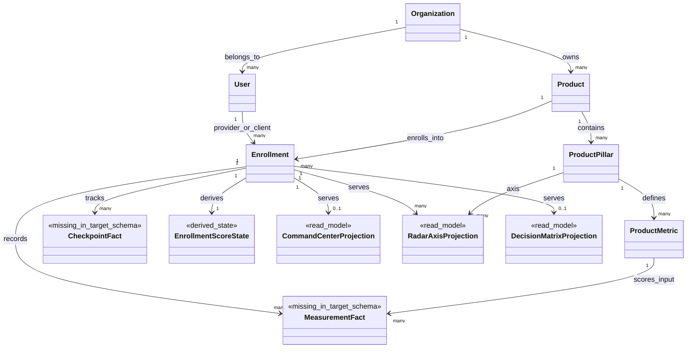
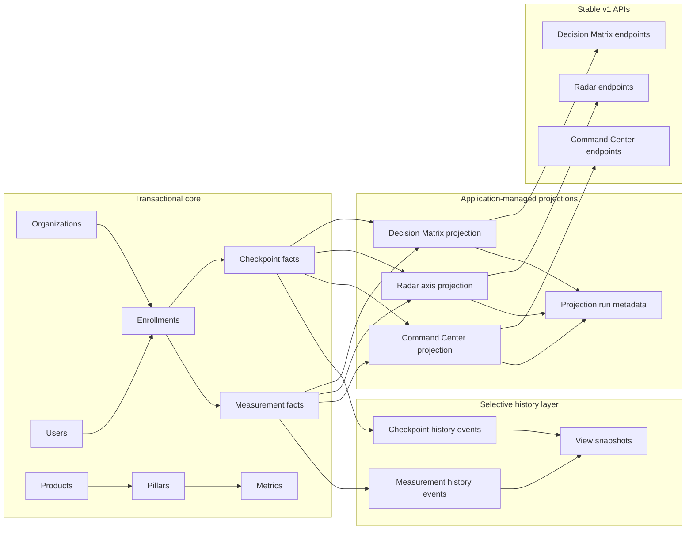
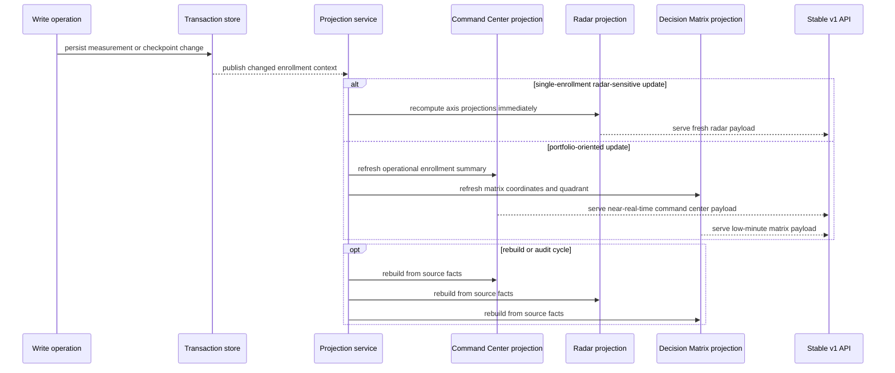
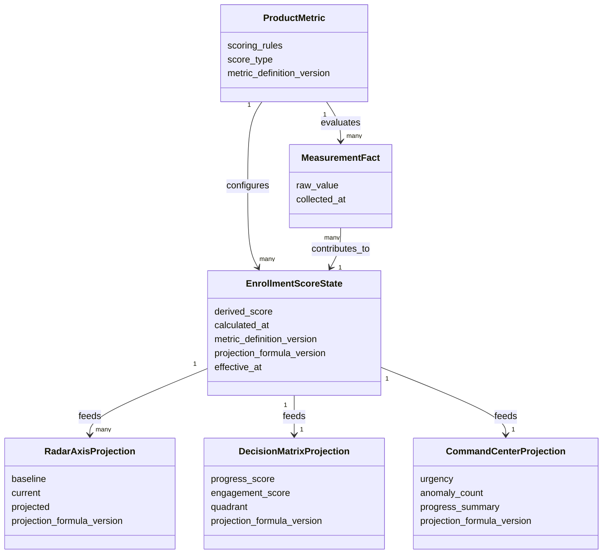

# Research Report: technical

**Date:** 2026-05-08
**Author:** dmene
**Research Type:** technical

---

## Research Overview

This document is an exploratory technical research note about how to extend the current data architecture so the platform can store and serve data for Command Center, Evolution Radar, and Decision Matrix without locking the team into a final architecture too early. The baseline used here is the current proposed relational core in [docs/architecture/new_database_architecture.md](c:/Users/dmene/Projetos/innovai/git/swaif_LTV-mentor/docs/architecture/new_database_architecture.md), the frozen v1 contracts for the three views, and the repo's current service and route boundaries.

The core research finding is that the current relational proposal is a necessary foundation, but it is not yet sufficient to support the three analytical views on its own. Those views depend on data classes that remain outside the proposed tables today, especially measurements, checkpoints, derived overall scores, and view-oriented projections. The most promising space to explore is not a single storage pattern, but a constrained hybrid: normalized transactional core plus selective history capture plus query-optimized projections for the three views.

This is not a final architecture decision. It is a structured brainstorm of option space, candidate entities, aggregation boundaries, freshness targets, and tradeoffs, with current public-source verification for CQRS, materialized views, and event sourcing.

## Executive Summary

The attached database architecture already establishes a useful transactional backbone around organizations, users, products, pillars, metrics, and enrollments. However, the current analytical surfaces in this repo do not read only from those entities. Command Center, Evolution Radar, and Decision Matrix also depend on measurement facts, checkpoint progression, derived per-pillar/per-enrollment scores, and operational signals such as urgency, anomaly, trend, and projection state. In the current codebase, these concerns are still built from JSON-backed repositories and service-side derivations.

This means the data modeling question is not only “which tables should exist,” but also “which data should be authoritative transaction state, which data should be historical evidence, and which data should be disposable projections.” The most important modeling boundary is the distinction between write-authoritative domain data and read-optimized view data. If that boundary is not explicit, the platform risks coupling view-specific storage decisions directly into the transactional schema.

The research suggests five viable modeling directions to compare: pure normalized relational core with live queries; normalized core plus derived read models; native materialized views; snapshot-oriented view tables; and event/history-driven projections. None of these is universally correct. The repo's current constraints, especially the frozen v1 API contract and the brownfield coexistence with JSON-backed measurement/checkpoint data, point toward a selective hybrid model as the strongest area to explore first, while keeping full event sourcing as a narrow, later-stage option rather than a system-wide rewrite.

**Key exploratory findings:**

- The current relational proposal is sufficient for identity, product, and enrollment structure, but insufficient for the three analytical views without new measurement/checkpoint/history/projection entities.
- `enrollments.decision_matrix_status` is likely too narrow to be the main source of truth for Decision Matrix; it fits better as a cached summary or filter helper than as authoritative analytical state.
- Evolution Radar is naturally a projection problem: baseline, current, projected, insight, and axis-level deltas are query shapes, not clean transactional roots.
- Command Center needs an enrollment-centric operational view that blends current-state facts with alerting/exception signals and checkpoint cadence.
- Decision Matrix is the strongest candidate for a denormalized projection because its query shape is portfolio-first and heavily aggregation-driven.
- Native PostgreSQL materialized views are attractive for slower reporting and rebuildable query acceleration, but their refresh model and staleness tradeoffs make them incomplete as the only answer for these three surfaces.
- Full CQRS or event sourcing should only be considered for bounded parts of the problem, not as a blanket pattern for the entire system.

## Table of Contents

1. Research Scope and Methodology
2. Current Baseline in This Repo
3. Data Modeling Problem Statement
4. Candidate Domain Entities and Relationships
5. Storage and Serving Model Options
6. View-by-View Modeling Hypotheses
7. Aggregation Boundaries and Write Ownership
8. Projection Strategies and Freshness Requirements
8A. Visual Architecture Diagrams
9. Scoring, Derivation, and Versioning Considerations
10. Comparative Tradeoff Assessment
11. Open Questions to Resolve Before Architecture Lock
12. Sources and Verification Notes

## 1. Research Scope and Methodology

### Research Topic

Data modeling and data architecture for Command Center, Evolution Radar, and Decision Matrix.

### Research Goals

- Use the current database architecture as the baseline.
- Explore options for storing and serving data for the three views.
- Compare normalized transactional tables, derived read models, materialized views, snapshot tables, event/history tables, and hybrid projection layers.
- Identify candidate entities, relationships, aggregation boundaries, projection strategies, freshness requirements, and tradeoffs.
- Stay exploratory and avoid final architecture lock, PRD work, epics, and sprint planning.

### Methodology

- Repo-grounded baseline review using current architecture docs, frozen contracts, and service/route locations.
- External source verification for pattern tradeoffs rather than relying only on internal assumptions.
- Focus on model boundaries, read/write asymmetry, projection durability, and operational complexity.
- Explicit separation between authoritative state, historical evidence, and disposable query projections.

## 2. Current Baseline in This Repo

### What the proposed relational baseline already covers

The attached architecture currently defines these relational roots:

- `deva_accmed_organizations`
- `deva_accmed_users`
- `deva_accmed_products`
- `deva_accmed_product_pillars`
- `deva_accmed_product_metrics`
- `deva_accmed_enrollments`

This is enough to express:

- organization ownership
- provider/client user identity
- product and method structure
- pillar and metric catalog
- enrollment relationship between provider, client, and product

### What the three views still need beyond that baseline

The current repo's backend and contracts show that the three views also depend on data that is not represented by the proposed relational schema yet:

- measurement facts per enrollment and metric
- checkpoint progression per enrollment
- derived overall or per-pillar scores
- urgency and anomaly signals
- projected values and explanatory insights
- portfolio-oriented query shapes optimized for the three views

Repo anchors:

- Current routes for the views already exist in `backend/app/api/routes/admin_students.py` and `backend/app/api/routes/mentor.py`.
- Current view logic is served through `backend/app/services/indicator_carga_service.py`.
- Current measurement/checkpoint/overall storage classes still exist under:
  - `backend/app/storage/measurement_repository.py`
  - `backend/app/storage/checkpoint_repository.py`
  - `backend/app/storage/measurement_overall_repository.py`
- Canonical coexistence/mapping seams already exist in `backend/app/storage/canonical_repositories.py`.

### Contract constraints that shape the brainstorm

The frozen v1 contract matters more than the storage choice:

- no endpoint renames
- no field removals or type changes
- mentoring vocabulary must remain at the API boundary
- internal target naming must not leak into current DTOs

That makes this a storage-and-projection design problem behind stable APIs, not a contract redesign exercise.

## 3. Data Modeling Problem Statement

The central modeling challenge is that the three views are not identical to the transactional model.

- Command Center is an operational exception-monitoring surface.
- Evolution Radar is a comparative axis projection surface.
- Decision Matrix is a prioritization surface built from aggregated scores and quadrant logic.

All three are read-oriented surfaces with different shapes, different freshness expectations, and different derived fields. If their requirements are forced directly into the transactional schema, the transactional model becomes polluted by UI-centric concerns. If everything is derived on demand from normalized tables only, query complexity and runtime cost rise sharply.

So the architecture question becomes: how much of the three views should be stored as current-state facts, how much should be derived on demand, and how much should be persisted as reusable projections?

## 4. Candidate Domain Entities and Relationships

### Core transactional entities

These appear to be the likely write-authoritative roots:

- `Organization`
- `User`
- `Product`
- `ProductPillar`
- `ProductMetric`
- `Enrollment`
- `MeasurementFact`
- `CheckpointFact`

### Candidate derived or supporting entities

These are the main candidates to discuss during architecture design:

- `MeasurementHistoryEvent`
  - append-only record of measurement changes
  - useful even without adopting full event sourcing
- `CheckpointHistoryEvent`
  - append-only record of checkpoint transitions
- `EnrollmentScoreState`
  - current derived score state per enrollment
  - optional denormalized helper for repeated reads
- `RadarAxisProjection`
  - one row per enrollment x pillar x projection version
  - baseline/current/projected/insight
- `CommandCenterProjection`
  - one row per enrollment for list/detail serving
  - urgency, days_left, progress, engagement, anomaly_count, checkpoint summary
- `DecisionMatrixProjection`
  - one row per enrollment for matrix coordinates and quadrant
  - progress score, engagement score, quadrant, renewal_reason, suggestion
- `ProjectionRun`
  - metadata for rebuilds, invalidation, and troubleshooting
- `ViewSnapshot`
  - point-in-time frozen copy for reporting, audit, or periodic review

### Relationship hypotheses

- `Organization -> Products -> ProductPillars -> ProductMetrics`
- `Users -> Enrollments <- Users`
  - provider and client are role-shaped relationships over `users`
- `Enrollments -> MeasurementFacts`
- `Enrollments -> CheckpointFacts`
- `Enrollments -> CommandCenterProjection`
- `Enrollments -> DecisionMatrixProjection`
- `Enrollments + ProductPillars -> RadarAxisProjection`

### Modeling note on `decision_matrix_status`

The current schema already includes `deva_accmed_enrollments.decision_matrix_status`. That field is useful as a lightweight cached discriminator, but it is probably too small to carry the full analytical meaning of the Decision Matrix. A stronger pattern is to treat it as one of these:

- a cache of the latest quadrant/status for simple filtering
- a write-through summary copied from a richer projection
- or a compatibility helper for narrow queries

It is less convincing as the authoritative store for all matrix logic.

## 5. Storage and Serving Model Options

### Option A: Pure normalized transactional tables with live query composition

Description:
Keep only normalized relational tables and assemble the three views through joins, aggregations, and service-level computation on demand.

Strengths:

- smallest number of persisted data representations
- simpler consistency story because current-state facts are single-source
- easier transactional integrity and referential consistency

Weaknesses:

- expensive query composition for portfolio and projection-heavy views
- service layer becomes crowded with read-shape assembly logic
- scaling and tuning become query-centric instead of model-centric

Best fit in this problem:

- low-volume admin usage
- early migration phases
- situations where the view contract is still volatile

### Option B: Normalized transactional core plus derived read-model tables

Description:
Persist authoritative transactional tables, then maintain query-optimized projection tables specifically for Command Center, Radar, and Matrix.

Strengths:

- preserves normalized write model while optimizing high-value reads
- aligns closely with CQRS-style read/write asymmetry without requiring system-wide CQRS
- projection shape can follow contract shape closely

Weaknesses:

- requires projection refresh/invalidation strategy
- eventual consistency becomes a design choice to explain and manage
- more storage representations to operate and test

Best fit in this problem:

- strongest exploratory candidate for the three views
- especially good for Matrix and Command Center portfolio queries

### Option C: Native PostgreSQL materialized views

Description:
Use PostgreSQL materialized views to precompute expensive joins and aggregations from transactional tables.

Strengths:

- simple conceptual model for disposable, rebuildable query acceleration
- native support in PostgreSQL
- indexable and suitable for slower dashboards/reporting

Weaknesses:

- refresh cadence creates staleness tradeoff
- awkward if per-enrollment updates must be visible immediately
- less flexible than application-managed projection tables for selective partial updates

Best fit in this problem:

- admin reporting slices
- slower portfolio analytics
- periodic rebuild scenarios

### Option D: Snapshot tables

Description:
Persist explicit point-in-time copies of analytical state, either per enrollment or per reporting window.

Strengths:

- excellent for audit, historical comparison, and “what did the mentor see then?” questions
- supports time-based analytics without re-deriving old state repeatedly
- good match for cycle reviews and change-over-time reporting

Weaknesses:

- can become storage-heavy if written too frequently
- snapshot semantics must be explicit: every write, daily, cycle-end, manual, or scheduled
- still does not replace a current-state serving strategy by itself

Best fit in this problem:

- historical radar comparison
- cycle-based decision analysis
- audit/reporting, not primary operational serving alone

### Option E: Event/history tables

Description:
Capture measurement and checkpoint changes as append-only history rows or domain events, then derive current state and projections from them.

Strengths:

- strong audit trail and temporal reconstruction
- supports rebuildable projections and debugging
- useful for tracking why a score or quadrant changed

Weaknesses:

- significant complexity increase if elevated into full event sourcing
- requires idempotency, ordering, versioning, and replay discipline
- hard to justify across the entire system if only a few areas benefit

Best fit in this problem:

- as selective history capture first
- not yet compelling as system-wide event sourcing for the full platform

### Option F: Hybrid projection layer

Description:
Use a normalized transactional core, optionally add append-only history for sensitive domains, and maintain application-managed read models tailored to each view.

Strengths:

- allows per-view optimization without forcing all domains into the same pattern
- works well with current frozen APIs and brownfield coexistence
- can evolve incrementally from the current repo state

Weaknesses:

- more moving parts than a pure CRUD relational model
- needs clear ownership boundaries and rebuild processes
- requires disciplined testing for projection drift

Best fit in this problem:

- strongest area to prototype first because it matches current constraints without overcommitting to full CQRS/event sourcing.

## 6. View-by-View Modeling Hypotheses

### Command Center

Primary read shape:

- one row per enrollment in current operational scope
- urgency
- days_left
- engagement/progress summary
- checkpoint state summary
- anomaly count or latest anomaly indicator
- selected student detail expansion data

Good candidate inputs:

- `Enrollment`
- latest measurement-derived scores
- checkpoint facts
- optional anomaly/event history

Serving model candidates:

- live assembled query in early phase
- dedicated `CommandCenterProjection` in stable phase
- optional periodic snapshots for audit/history

Freshness hypothesis:

- near-real-time preferred because it is an operational surface
- acceptable lag likely measured in seconds or low minutes, not hours

### Evolution Radar

Primary read shape:

- one enrollment context
- axis scores by pillar
- baseline, current, projected
- optional insight text per axis
- aggregate averages and deltas

Good candidate inputs:

- measurement facts
- metric scoring configuration from `product_metrics.scoring_rules`
- per-pillar aggregation logic
- optional projection parameters/version

Serving model candidates:

- on-demand derivation for a single selected student
- persisted `RadarAxisProjection` if repeated reads are common or projections are costly
- snapshots if historical “before/after cycle” review becomes important

Freshness hypothesis:

- single-student radar likely deserves the freshest data of the three views
- synchronous recompute or immediate post-write projection is more attractive here than scheduled refresh

### Decision Matrix

Primary read shape:

- one row per enrollment for portfolio scatter/bubble view
- `progress`
- `engagement`
- quadrant
- renewal reason
- suggestion
- LTV or commercial value
- filterable urgency or status

Good candidate inputs:

- enrollment-level derived scores
- thresholds and classification policy
- optional financial or retention indicators

Serving model candidates:

- dedicated `DecisionMatrixProjection` is highly attractive
- native materialized view can support periodic rebuilds if latency tolerance is higher
- snapshots are valuable for historical portfolio review

Freshness hypothesis:

- if used daily for mentor prioritization, low-minute freshness is useful
- if used more like a portfolio review dashboard, slightly slower refresh can be acceptable

## 7. Aggregation Boundaries and Write Ownership

### Candidate aggregate boundaries

Exploratory aggregate candidates:

- `EnrollmentAggregate`
  - likely owns current journey state, measurement/checkpoint linkage, and status transitions
- `ProductDefinitionAggregate`
  - owns product, pillars, metrics, scoring config
- `ProjectionAggregate` or projection jobs
  - should not own business truth; only derived read truth

### Write ownership hypothesis

- transactional tables own business truth
- history/event tables own historical evidence
- projections own query convenience only

This boundary matters because it determines rollback and rebuild semantics:

- if a projection is wrong, rebuild it
- if transactional facts are wrong, correct source data and re-project
- if history is authoritative, preserve immutability and correct via compensating records

## 8. Projection Strategies and Freshness Requirements

### Strategy 1: Synchronous in-transaction updates

Use when:

- projection is cheap to update
- user experience requires immediate visibility after a write
- the projection depends on a small local data slice

Fit:

- strongest on Radar for a single enrollment, weaker for large portfolio projections

### Strategy 2: Post-write background projection

Use when:

- read model is larger or more expensive to compute
- eventual consistency of seconds/minutes is acceptable
- projection updates should not slow write transactions

Fit:

- strong for Command Center and Decision Matrix

### Strategy 3: Scheduled refresh

Use when:

- dashboard tolerates staleness
- view is expensive to recompute continuously
- rebuild simplicity matters more than immediacy

Fit:

- strongest for materialized views and periodic reporting

### Freshness hypotheses by surface

| Surface | Likely freshness target | Why |
| --- | --- | --- |
| Command Center | seconds to low minutes | operational follow-up and exception monitoring |
| Evolution Radar | immediate to seconds | single-student analytical view after edits |
| Decision Matrix | low minutes to scheduled, depending on usage | portfolio prioritization tolerates slightly more lag |

## 8A. Visual Architecture Diagrams

The diagrams below make the exploratory boundaries easier to inspect without changing the note's conclusions. They are meant to visualize the current gap between the relational baseline and the three analytical surfaces, plus the most promising hybrid direction discussed above.

### Diagram 1. Baseline entities plus missing analytics data

This class-style view separates the relational backbone that already exists from the analytical data classes the three views still need. The main point is that the current baseline is structurally useful, but it does not yet model the measurement, checkpoint, score, and projection layers that the analytical views consume.

### Diagram 2. Hybrid transactional, history, and projection architecture

This flow emphasizes the likely separation of concerns: transactional tables hold business truth, optional history tables preserve evidence, and view-specific projections exist only to serve read-heavy analytical surfaces. That is the narrow hybrid currently worth validating further.

### Diagram 3. Projection and update flow across the three views

This sequence view shows the operational path from source changes into read models. It highlights where freshness policies can diverge: Radar may justify immediate recompute for one enrollment, while Command Center and Decision Matrix can tolerate short background lag.

### Diagram 4. Scoring and versioning lineage

This lineage view connects metric configuration to derived scores and downstream projections. The practical purpose is traceability: when scoring rules or formulas change, the team needs enough metadata to explain which version produced each analytical output.

## 9. Scoring, Derivation, and Versioning Considerations

The attached architecture also includes the metric DSL discussion. That matters here because `product_metrics.scoring_rules` is configuration, not a read model.

Exploratory implication:

- keep metric definition and scoring DSL in catalog/config tables
- persist calculated outputs separately from the DSL definition
- record enough metadata to know which scoring version produced a derived score

Candidate versioning fields to discuss:

- `metric_definition_version`
- `projection_formula_version`
- `calculated_at`
- `source_window` or `effective_at`

Without version traceability, the team will eventually struggle to explain why a Radar axis or Matrix quadrant changed after a scoring grammar revision.

## 10. Comparative Tradeoff Assessment

| Model | Current-state consistency | Query performance | Historical reconstruction | Operational complexity | Fit with current repo |
| --- | --- | --- | --- | --- | --- |
| Pure normalized relational | strong | medium to low for heavy analytics | low unless extra history added | low to medium | good first-step baseline, weak final serving model |
| Derived read-model tables | medium to strong depending on refresh | high | low to medium | medium | strong fit |
| PostgreSQL materialized views | eventual | high for targeted queries | low unless snapshots/history added | medium | useful selectively |
| Snapshot tables | strong for captured points in time | high for historical review | high | medium | useful complement |
| Event/history tables | medium to high depending on design | medium unless projected | high | high | good selectively, risky broadly |
| Hybrid projection layer | medium to strong by component | high | medium to high | medium to high | strongest exploratory candidate |

## 11. Open Questions to Resolve Before Architecture Lock

1. Should measurements and checkpoints become fully relational current-state facts first, or should history capture be introduced at the same time?
2. Which surface needs true immediate consistency versus “fresh within a minute” consistency?
3. Is `decision_matrix_status` only a cache, or does the product expect it to participate in workflow state transitions?
4. Does Radar need historical comparison as a first-class feature, or only current baseline/current/projected?
5. Are anomalies in Command Center durable business records, computed alerts, or UI-only derived diagnostics?
6. Will product teams need to rebuild projections after scoring-rule revisions, and if yes, what version markers must be stored now?
7. Is the portfolio view query volume high enough to justify projection tables immediately, or can live queries bridge the first migration phase?

## 12. Sources and Verification Notes

### External sources

- Microsoft Azure Architecture Center, CQRS pattern:
  - https://learn.microsoft.com/en-us/azure/architecture/patterns/cqrs
- Microsoft Azure Architecture Center, Materialized View pattern:
  - https://learn.microsoft.com/en-us/azure/architecture/patterns/materialized-view
- Microsoft Azure Architecture Center, Event Sourcing pattern:
  - https://learn.microsoft.com/en-us/azure/architecture/patterns/event-sourcing
- Martin Fowler, CQRS:
  - https://martinfowler.com/bliki/CQRS.html
- Martin Fowler, Event Sourcing:
  - https://martinfowler.com/eaaDev/EventSourcing.html
- PostgreSQL documentation, Materialized Views:
  - https://www.postgresql.org/docs/current/rules-materializedviews.html

### Repo-grounded sources

- Current relational baseline: `docs/architecture/new_database_architecture.md`
- Platform framing: `docs/architecture/platform_architecture_operational_model.md`
- Frozen v1 contract: `docs/mvp-mentoria/contracts-freeze-v1.md`
- Command Center contract: `docs/mvp-mentoria/contracts-command-center.md`
- Radar contract: `docs/mvp-mentoria/contracts-radar.md`
- Decision Matrix contract: `docs/mvp-mentoria/contracts-renewal-matrix.md`
- Naming/domain notes: `docs/mvp-mentoria/naming-and-domain-notes.md`
- Frontend integration architecture: `docs/mvp-mentoria/frontend-integration-architecture.md`
- Current route/service anchors:
  - `backend/app/api/routes/admin_students.py`
  - `backend/app/api/routes/mentor.py`
  - `backend/app/services/indicator_carga_service.py`
  - `backend/app/storage/measurement_repository.py`
  - `backend/app/storage/checkpoint_repository.py`
  - `backend/app/storage/measurement_overall_repository.py`
  - `backend/app/storage/canonical_repositories.py`

## Research Synthesis

### Brainstorm Synthesis

If the platform were a clean-slate analytics system, a broader CQRS/event-driven architecture might be tempting. But this repo is a brownfield system with frozen v1 APIs, existing route/service boundaries, and current JSON-backed measurement/checkpoint flows that still participate in the three views. That makes a fully ideological choice less useful than a boundary-conscious one.

The core exploratory direction worth carrying into architecture work is this: keep business truth normalized and transactional, treat history as an optional but valuable append-only layer, and treat the three analytical surfaces as first-class projections rather than pretending they are natural tables inside the transactional core. That direction leaves room to start small, validate read shapes, and postpone heavier event-driven complexity unless auditability, replay, or historical reconstruction truly justify it.

### Non-final exploratory hypothesis

The most promising option to investigate next is a hybrid projection layer built on:

- normalized relational current-state entities
- selective history capture for measurements/checkpoints or score changes
- application-managed projection tables for Command Center, Radar, and Decision Matrix
- optional PostgreSQL materialized views for slower reporting slices

This is intentionally framed as a hypothesis to validate, not as a locked architecture decision.

---

<!-- Content will be appended sequentially through research workflow steps -->