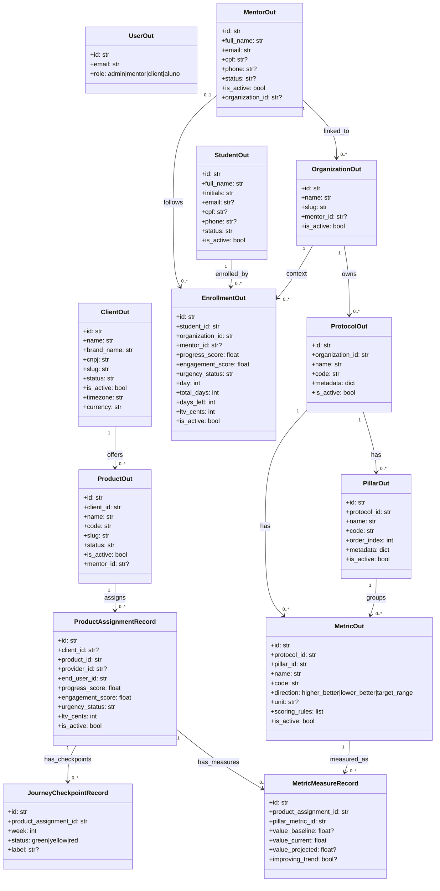
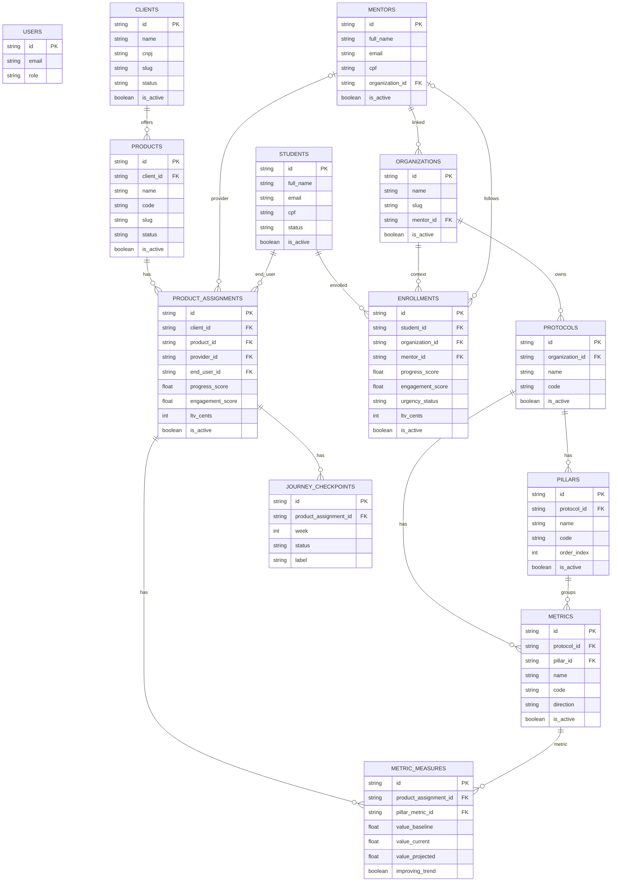

# Relatório — Diagrama de Classes e Entidade-Relacionamento (Backend)

Este relatório descreve a modelagem principal do backend com base nos schemas e no modelo canônico da aplicação.

## 1) Diagrama de Classes (domínio + contratos principais)

## 2) Diagrama Entidade-Relacionamento (ER)

## 3) Observações de modelagem

- O backend atual usa persistência em arquivos JSON via repositórios, mas as entidades e chaves acima já permitem mapear uma migração para banco relacional sem alterar o contrato de API.
- Há duas visões complementares de domínio: a visão MVP (`organization`, `mentor`, `student`, `enrollment`) e a visão canônica (`client`, `product`, `provider`, `end_user`, `product_assignment`).
- O diagrama ER acima unifica ambas porque elas coexistem no backend atual.

## 4) Avaliação de impacto: migração de JSON para Supabase (Postgres)

### 4.1 Impactos positivos esperados

- **Consistência transacional**: operações hoje distribuídas em múltiplos arquivos JSON (por exemplo vínculo aluno/mentoria + medições + checkpoints) passam a poder usar transações atômicas.
- **Integridade referencial nativa**: FKs, constraints e índices passam a garantir relações (`enrollments.student_id`, `metrics.pillar_id`, etc.) no nível do banco.
- **Escalabilidade de leitura/escrita**: elimina contenção de I/O em arquivo e reduz risco de corrupção por escrita concorrente.
- **Consultas analíticas melhores**: joins, agregações e filtros complexos para Centro/Radar/Matriz ficam mais simples e performáticos.
- **Operação e observabilidade**: Supabase fornece backup gerenciado, monitoramento e trilha de auditoria mais robusta que armazenamento local em arquivo.

### 4.2 Impactos técnicos no backend atual

1. **Camada de storage**
   - Repositórios em `backend/app/storage/*` deixariam de usar `json_repository.py` como backend primário.
   - Necessário criar adaptadores/repositórios SQL mantendo a mesma interface de serviço para reduzir impacto na API.

2. **Serviços de domínio**
   - Serviços em `backend/app/services/*` tendem a precisar de ajustes para operações transacionais (create/update/link/unlink/reassign).
   - Regras de idempotência e conflito (`409`) devem continuar inalteradas na superfície HTTP.

3. **Contratos e rotas**
   - Endpoints e payloads podem permanecer estáveis (objetivo recomendado), preservando o contrato v1 e envelope de erro.
   - Alterações devem ser internas (storage/repository), sem breaking change para frontend.

4. **Testes**
   - Parte dos testes de integração hoje focados em JSON deverá ganhar equivalentes com banco real (ou container Postgres).
   - Deve-se manter testes de API para garantir paridade de comportamento e de payload de erro.

### 4.3 Riscos e pontos de atenção

- **Migração de dados legados**: risco de inconsistência entre estruturas MVP e canônicas se o mapeamento não for validado com reconciliação.
- **Mudança semântica involuntária**: defaults e campos opcionais atuais podem divergir ao virar colunas NOT NULL/NULL sem regra explícita.
- **Quebra de fluxos operacionais**: rotinas de backup/restore atuais baseadas em arquivos precisam de equivalente operacional no Supabase.
- **Custos e latência de rede**: acesso remoto ao banco traz novo perfil de latência e custo (egresso, pooling, limites do plano).
- **Segurança e compliance**: revisão de políticas RLS, gestão de segredos e segregação de ambientes (dev/staging/prod) passa a ser obrigatória.

### 4.4 Estratégia recomendada (menor risco)

1. **Fase 0 — Congelamento de contrato**
   - Confirmar invariantes: endpoints, schemas de saída, códigos de erro e semântica.

2. **Fase 1 — Esquema relacional alvo**
   - Gerar DDL a partir do ER deste documento.
   - Definir constraints mínimas (PK, FK, unique e índices por chaves de busca frequentes).

3. **Fase 2 — Repositórios dual-write controlado (opcional)**
   - Escrita em Postgres + JSON temporariamente para validação de paridade.
   - Comparação automática de outputs críticos (ex.: listagens administrativas e projeções).

4. **Fase 3 — Cutover de leitura**
   - Mover leituras para Postgres por feature flag.
   - Monitorar divergências e performance.

5. **Fase 4 — Desativação JSON**
   - Remover escrita JSON após janela de estabilização.
   - Manter plano de rollback com snapshot consistente.

### 4.5 Esforço relativo por área (estimativa qualitativa)

- **Storage/repositories**: alto.
- **Services (transações e conflitos)**: médio-alto.
- **API/rotas/contratos**: baixo (se mantidos estáveis).
- **Testes e validação de paridade**: alto.
- **DevOps/segurança/observabilidade**: médio-alto.

### 4.6 Critérios de sucesso da migração

- Zero breaking change nos contratos v1.
- Paridade funcional nos fluxos críticos (auth, vínculo aluno, carga de indicadores, Centro/Radar/Matriz).
- Redução de falhas por concorrência e melhoria mensurável de tempo de resposta em consultas agregadas.
- Processo de backup/restore homologado no novo ambiente.
