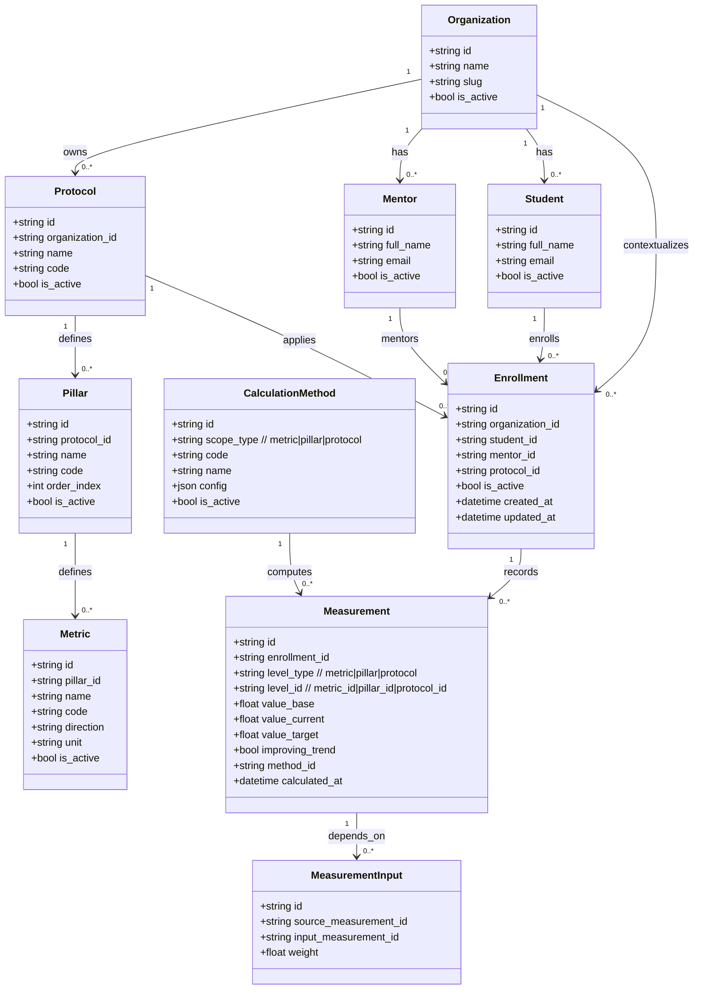
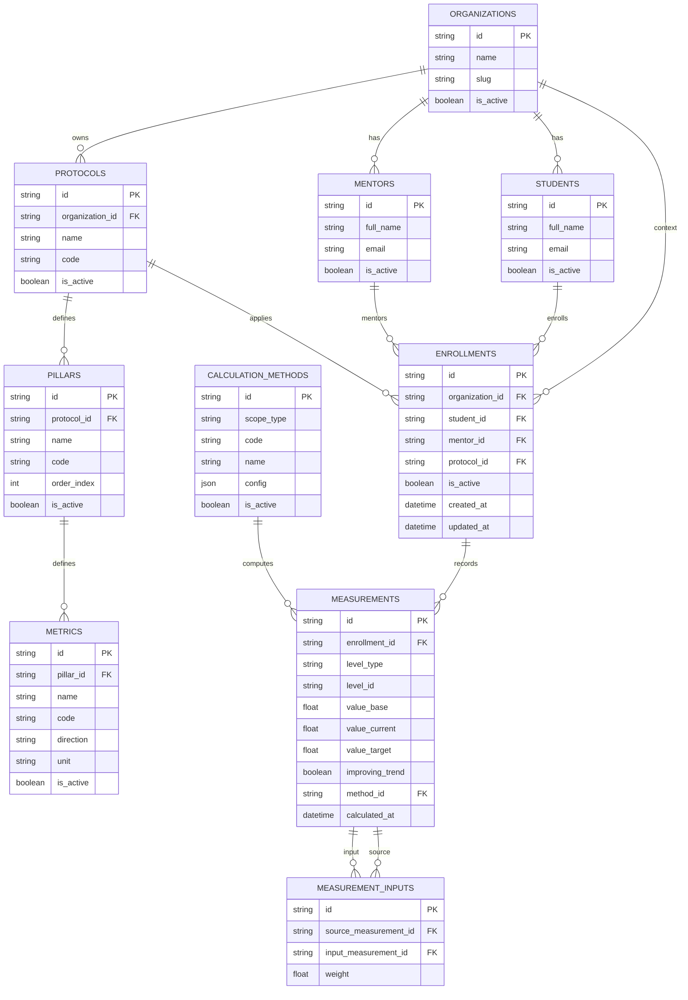
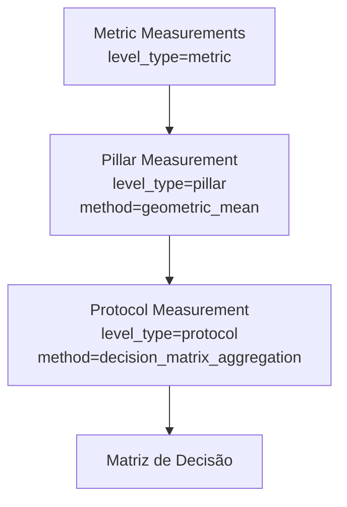

# Modelo de Dados (Mermaid)

Este documento descreve o **redesenho proposto** para validar o reajuste estrutural do domínio.

## Premissas de negócio (alinhadas)

- Uma **Organization** pode possuir **N Protocols**, **N Mentors**, **N Students** e **N Enrollments**.
- Não existe relação obrigatória direta entre Mentor, Student e Protocol fora de Enrollment.
- **Enrollment** é o vínculo que conecta: **Student + Mentor + Protocol** (e o contexto organizacional).
- **Protocol** possui **Pillars**.
- **Pillar** possui **Metrics**.
- Cálculo e apresentação usam a entidade **Measurement** com diferentes escopos:
  - medição de **Metric** (valor base do domínio)
  - medição de **Pillar** (agregação geométrica das métricas)
  - medição de **Protocol** para matriz de decisão (agregação dos pilares por método próprio)
- O conceito de `measurement_overalls` é substituído por medições explícitas por escopo + método.

---

## 1) Diagrama de Classes (Modelo Alvo)

---

## 2) Modelo Entidade-Relacionamento (ER) Alvo

---

## 3) Fluxo de cálculo por escopo

---

## 4) Estratégia de transição recomendada

1. Introduzir `protocol_id` explícito em `enrollments`.
2. Migrar `measurement_overalls` para `measurements(level_type=pillar|protocol)`.
3. Registrar método de cálculo em `calculation_methods` e vínculo em `measurements.method_id`.
4. Persistir rastreabilidade de agregação em `measurement_inputs`.
5. Atualizar serviços de leitura para consumir medições por escopo.
