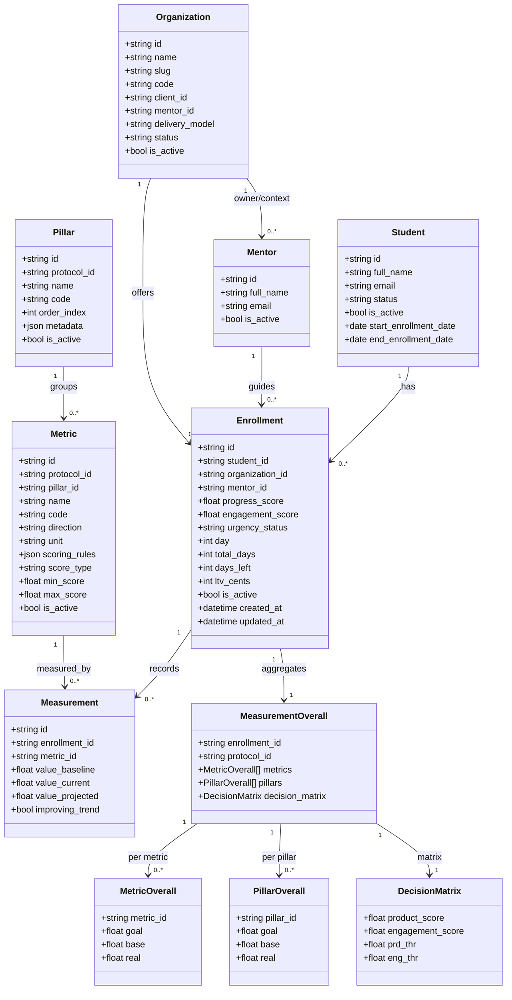
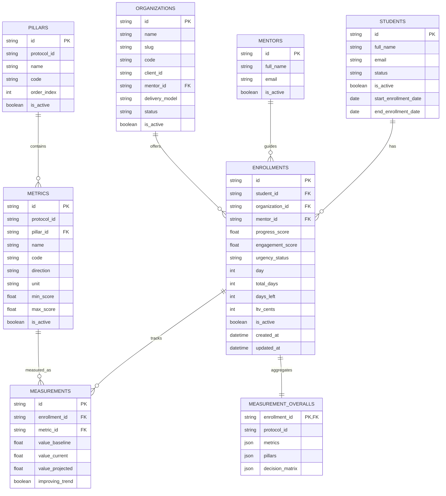

# Modelo de Dados (Mermaid)

Este documento descreve o modelo atual dos dados JSON em formato de:

1. Diagrama de classes
2. Modelo Entidade-Relacionamento (ER)

## 1) Diagrama de Classes

## 2) Modelo Entidade-Relacionamento (ER)

## Observações

- `measurement_overalls` é uma estrutura agregada para leitura rápida (denormalizada).
- `measurements` é o nível de granularidade por enrollment + métrica.
- Pilares e métricas são estruturados por protocolo.
