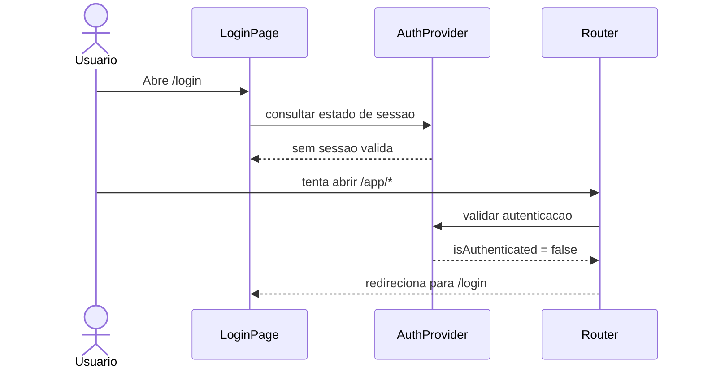
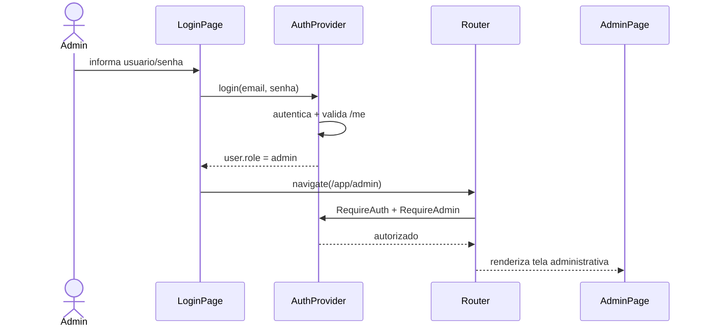
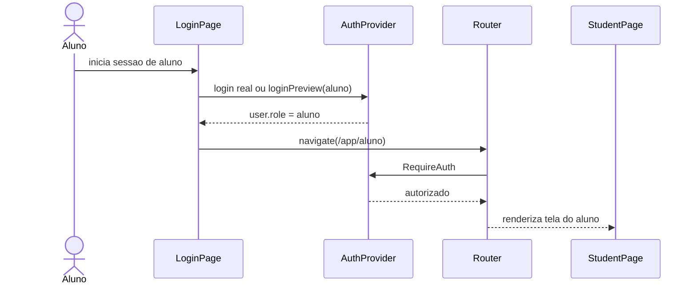
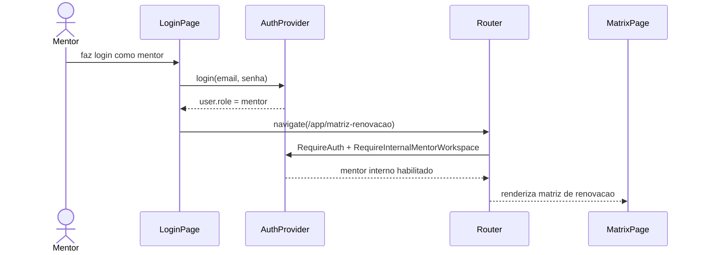
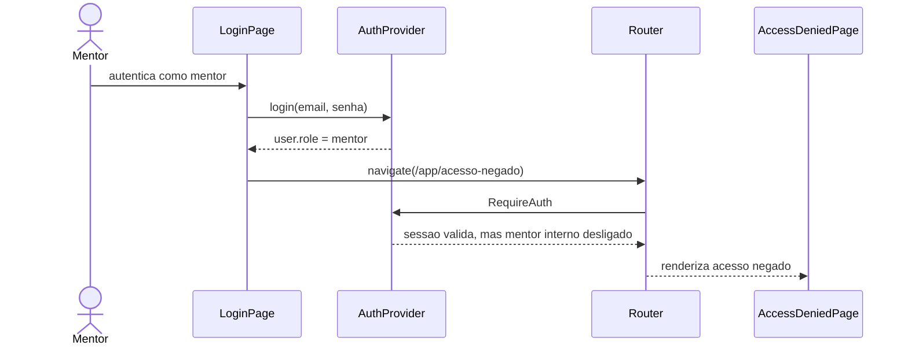
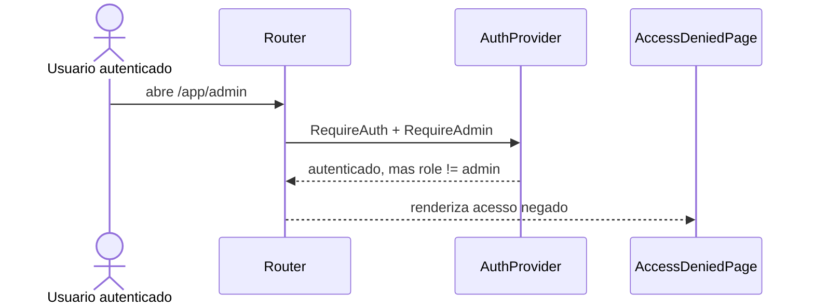
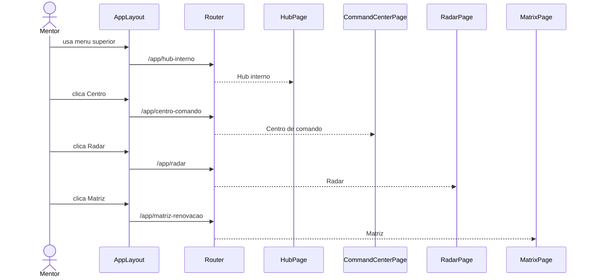
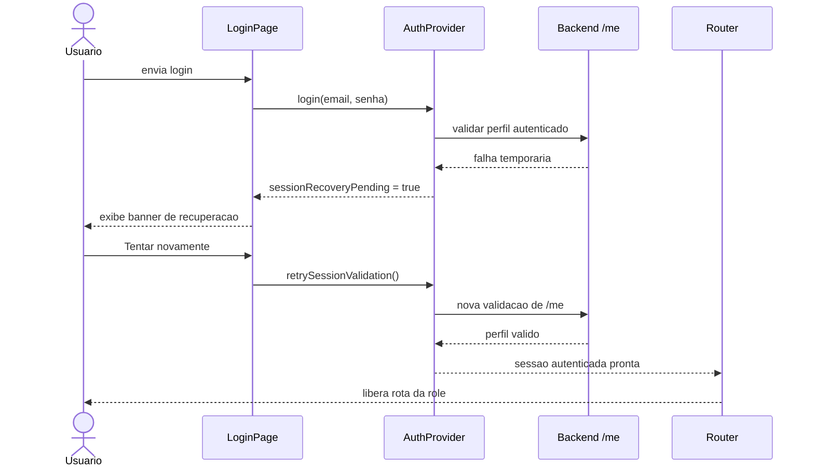

# Sequence Diagrams - User Navigation

Date: 2026-03-21

## Objetivo

Documentar os fluxos de navegacao por tipo de usuario no frontend atual, com foco nas telas efetivamente usadas no roteamento e nas guardas de autenticacao e autorizacao.

## Arquivos de referencia

- Roteamento principal: `frontend/src/app/routes.tsx`
- Redirecionamento por papel: `frontend/src/shared/auth/roleRouting.ts`
- Sessao e autenticacao: `frontend/src/app/providers/AuthProvider.tsx`
- Shell comum: `frontend/src/app/layout/AppLayout.tsx`

## Diretorio das telas

| Tela | Caminho |
| ---- | ------- |
| Login | `frontend/src/pages/LoginPage.tsx` |
| Acesso negado | `frontend/src/pages/AccessDeniedPage.tsx` |
| Admin | `frontend/src/features/admin/pages/AdminPage.tsx` |
| Aluno | `frontend/src/features/student/pages/StudentPage.tsx` |
| Hub interno mentor | `frontend/src/features/hub/pages/HubPage.tsx` |
| Centro de comando | `frontend/src/features/command-center/pages/CommandCenterPage.tsx` |
| Radar | `frontend/src/features/radar/pages/RadarPage.tsx` |
| Matriz de renovacao | `frontend/src/features/matrix/pages/MatrixPage.tsx` |
| Shell comum | `frontend/src/app/layout/AppLayout.tsx` |
| Pagina nao encontrada | `frontend/src/pages/NotFoundPage.tsxfrontend/src/pages/NotFoundPage.tsx` |

## 1. Usuario anonimo

Telas envolvidas:
- `frontend/src/pages/LoginPage.tsx`

## 2. Usuario Admin

Telas envolvidas:
- `frontend/src/pages/LoginPage.tsx`
- `frontend/src/features/admin/pages/AdminPage.tsx`

## 3. Usuario Aluno

Telas envolvidas:
- `frontend/src/pages/LoginPage.tsx`
- `frontend/src/features/student/pages/StudentPage.tsx`

## 4. Usuario Mentor interno

Observacao:
- este fluxo so existe quando `VITE_ENABLE_INTERNAL_MENTOR_DEMO=true`
- o objetivo atual e validacao interna local, nao superficie publicada ao cliente

Telas envolvidas:
- `frontend/src/pages/LoginPage.tsx`
- `frontend/src/features/matrix/pages/MatrixPage.tsx`

## 5. Mentor com superficie interna desligada

Telas envolvidas:
- `frontend/src/pages/LoginPage.tsx`
- `frontend/src/pages/AccessDeniedPage.tsx`

## 6. Usuario autenticado sem permissao administrativa

Telas envolvidas:
- `frontend/src/pages/AccessDeniedPage.tsx`

## 7. Navegacao interna do mentor

Telas envolvidas:
- `frontend/src/app/layout/AppLayout.tsx`
- `frontend/src/features/hub/pages/HubPage.tsx`
- `frontend/src/features/command-center/pages/CommandCenterPage.tsx`
- `frontend/src/features/radar/pages/RadarPage.tsx`
- `frontend/src/features/matrix/pages/MatrixPage.tsx`

## 8. Recuperacao de sessao apos falha temporaria

Telas envolvidas:
- `frontend/src/pages/LoginPage.tsx`

## Resumo operacional atual

- `Admin` e a superficie principal publicada.
- `Aluno` segue como rota funcional no app.
- `Mentor` permanece isolado do caminho publicado e depende de flag local explicita.
- `Acesso negado` e a tela padrao para bloqueios de papel ou de superficie nao publicada.
- O shell comum concentra a navegacao de alto nivel e oculta links conforme o papel e a flag de ambiente.
